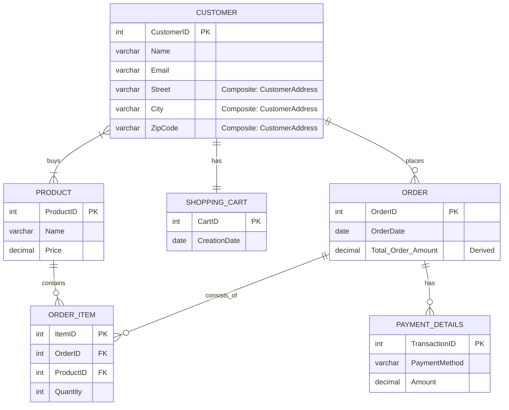

# Module 1: **Introduction to Databases & SQL Server**

> **Module Objective**
> To provide learners with a comprehensive understanding of database fundamentals, SQL Server architecture, modeling techniques (ERD, DFD), and the tools required for database development and management.


## Learning Outcomes

By the end of this module, learners will be able to:

1. Explain the fundamental concepts of relational and non-relational databases.
2. Design and interpret ERDs and DFDs.
3. Describe SQL Server architecture and its key components.
4. Identify various SQL Server editions and related tools.
5. Compare SQL Server with other popular database platforms.
6. Install SQL Server and explore its environment.


## Reference Materials

* **Books:**

  * "Database System Concepts" by Silberschatz, Korth, and Sudarshan
  * "Microsoft SQL Server 2022: A Beginner’s Guide" by Dusan Petkovic
* **Online Resources:**

  * Microsoft Learn: SQL Server Introduction
  * ERDPlus ([https://erdplus.com](https://erdplus.com))
  * Lucidchart ([https://www.lucidchart.com](https://www.lucidchart.com))
  * draw\.io ([https://app.diagrams.net](https://app.diagrams.net))
  * Azure SQL Documentation ([https://learn.microsoft.com/en-us/azure/azure-sql/](https://learn.microsoft.com/en-us/azure/azure-sql/))


## Key Concepts & Detailed Content


### 1. **Introduction to Databases**

* **Definition**: A database is a collection of interrelated data and programs designed to access and modify that data.
* **Types**:

  * Relational (SQL Server, MySQL, PostgreSQL)
  * NoSQL (MongoDB, Cassandra)
  * Hierarchical (IMS)
* **Core Elements**:

  * **Entities**: An entity is a "thing" or "object" in the real world that is distinct from all other objects. Entities can be concrete, such as a person or a book, or abstract, like a course offering or a flight reservation. An entity set is a collection of entities of the same type that share similar properties or attributes. For example, "instructor" could be an entity set representing all instructors at a university.
  * **Attributes**: Attributes are descriptive properties that each member of an entity set possesses. They define the characteristics of an entity. For instance, an instructor entity set might have attributes like ID, name, dept_name, and salary. Each entity will have its own specific value for each attribute.
  * **Relationships**: Relationships describe how entities are connected or associated with each other. For example, in a university database, a student entity might "take" a course offering entity, and an instructor entity "teaches" a course offering. These "takes" and "teaches" are examples of relationships between entities. The Entity-Relationship (E-R) model helps in mapping these real-world meanings and interactions into a conceptual schema for the database.

### 2. **Database Design Using ER Diagrams**

* **Entity Types**:

  * Strong (independent), Weak (dependent)
* **Attributes**:

  * Simple, Composite, Derived
* **Relationships**:

  * One-to-One (1:1), One-to-Many (1\:N), Many-to-Many (M\:N)
* **Notation and Symbols**: Crow’s foot, UML, etc.
* **Tools**: draw\.io, Lucidchart, ERDPlus

### 2. **Database Design Using ER Diagrams**

Database design using Entity-Relationship (ER) Diagrams is a crucial step in creating efficient and well-structured databases. It involves identifying and modeling the key components of the system.

* **Entity Types**:
    * **Strong (Independent) Entity**: An entity that can exist on its own and has a unique primary key. It does not depend on another entity for its existence. For example, a "Customer" or a "Product" in a shopping cart system.
    * **Weak (Dependent) Entity**: An entity whose existence depends on another (strong) entity. It does not have a primary key of its own; its primary key is derived in part from the strong entity it depends on. For example, "Payment Details" for a specific order, where the payment details wouldn't exist without the order.

* **Attributes**:
    * **Simple**: An attribute that cannot be broken down into smaller, meaningful parts. For example, "Name" or "Price".
    * **Composite**: An attribute that can be divided into several simpler attributes. For example, "Address" could be composed of "Street", "City", and "Zip Code".
    * **Derived**: An attribute whose value can be calculated from other attributes and is not stored directly in the database. For example, "Total Order Amount" can be derived from the sum of prices of all items in an order.

* **Relationships**:
    * **One-to-One (1:1)**: Each entity in one set is related to at most one entity in another set. For example, a "Customer" might have one "Shopping Cart" at a time.
    * **One-to-Many (1:N)**: One entity in the first set can be related to multiple entities in the second set, but each entity in the second set is related to at most one entity in the first set. For example, one "Order" can have many "Order Items".
    * **Many-to-Many (M:N)**: Entities in both sets can be related to multiple entities in the other set. For example, many "Customers" can "buy" many "Products", and many "Products" can be "bought" by many "Customers".

* **Notation and Symbols**:
    Various graphical notations are used to draw ER Diagrams, helping to visually represent the entities, attributes, and relationships. Common ones include:
    * **Crow’s Foot Notation**: Popular for its clear representation of cardinality (the "one" or "many" side of a relationship) using symbols that resemble a crow's foot.
      ```mermaid
       erDiagram
          A ||--o| B : "One or Zero"
          C ||--|| D : "One and only One"
          E }o--o{ F : "Zero or Many"
          G }|--|{ H : "One or Many"
      ```
    * **UML (Unified Modeling Language)**: While primarily used for object-oriented design, UML class diagrams can be adapted to model ER concepts.
    * **Chen Notation**: An older, more traditional notation that uses rectangles for entities, diamonds for relationships, and ovals for attributes.
 
#### 2.1. This Mermaid ER Diagram models a simplified e-commerce or shopping cart system. Let's break down its components:

* **CUSTOMER**: Represents individuals making purchases.
    * `CustomerID` (PK): Unique identifier for each customer.
    * `Name`, `Email`: Simple attributes storing customer information.
    * `Street`, `City`, `ZipCode`: These collectively form a **Composite Attribute** named "CustomerAddress," although individually listed here.
* **PRODUCT**: Represents items available for purchase.
    * `ProductID` (PK): Unique identifier for each product.
    * `Name`, `Price`: Simple attributes describing the product.
* **ORDER**: Represents a customer's purchase.
    * `OrderID` (PK): Unique identifier for each order.
    * `OrderDate`: Simple attribute indicating when the order was placed.
    * `Total_Order_Amount` (Derived): This is a **Derived Attribute**, meaning its value is calculated from the prices and quantities of the products within the order, rather than being stored directly.
* **PAYMENT_DETAILS**: Represents the payment information for an order.
    * `TransactionID` (PK): Unique identifier for a payment transaction.
    * `PaymentMethod`, `Amount`: Simple attributes.
    * **Weak Entity**: This entity is likely a weak entity, as specific payment details usually depend on the existence of an `ORDER`. The relationship `ORDER ||--o{ PAYMENT_DETAILS` suggests this dependency.
* **SHOPPING_CART**: Represents a customer's current shopping cart.
    * `CartID` (PK): Unique identifier for a shopping cart.
    * `CreationDate`: Simple attribute.
* **ORDER_ITEM**: Represents a specific product included in an order. This often acts as a "bridge" or "junction" entity to resolve many-to-many relationships.
    * `ItemID` (PK): Unique identifier for each item within an order.
    * `OrderID` (FK): Foreign key linking to the `ORDER` it belongs to.
    * `ProductID` (FK): Foreign key linking to the `PRODUCT` being ordered.
    * `Quantity`: Simple attribute indicating how many units of the product are in this order item.

#### 2.2 Relationships and Cardinality:

* **CUSTOMER ||--o{ ORDER : places**
    * **One-to-Many (1:N)**: A `CUSTOMER` can `places` many `ORDER`s, but each `ORDER` is placed by only one `CUSTOMER`. The `||--o{` notation means "exactly one" on the left side (customer) and "zero or many" on the right side (order).
* **CUSTOMER ||--|| SHOPPING_CART : has**
    * **One-to-One (1:1)**: A `CUSTOMER` `has` exactly one `SHOPPING_CART`, and a `SHOPPING_CART` belongs to exactly one `CUSTOMER`.
* **CUSTOMER }|--|{ PRODUCT : buys**
    * **Many-to-Many (M:N)**: Many `CUSTOMER`s can `buys` many `PRODUCT`s, and many `PRODUCT`s can be `bought` by many `CUSTOMER`s. The `}|--|{` notation signifies "many" on both sides. In a relational database, this relationship is typically resolved by an intermediary table, which in our diagram is `ORDER_ITEM`.
* **ORDER ||--o{ ORDER_ITEM : consists_of**
    * **One-to-Many (1:N)**: An `ORDER` `consists_of` many `ORDER_ITEM`s, but each `ORDER_ITEM` belongs to only one `ORDER`.
* **ORDER ||--o{ PAYMENT_DETAILS : has**
    * **One-to-Many (1:N)**, specifically representing a **Weak Entity Relationship**: An `ORDER` `has` many `PAYMENT_DETAILS` (though often it's one order to one payment, this notation allows for multiple payments or payment attempts). The `o{` on the `PAYMENT_DETAILS` side also implies it might be a weak entity, relying on `ORDER` for its existence.
* **PRODUCT ||--o{ ORDER_ITEM : contains**
    * **One-to-Many (1:N)**: A `PRODUCT` can be `contains` in many `ORDER_ITEM`s, but each `ORDER_ITEM` `contains` only one `PRODUCT`. This relationship, along with `ORDER ||--o{ ORDER_ITEM`, shows how `ORDER_ITEM` acts as the bridge for the many-to-many relationship between `ORDER` and `PRODUCT`.

#### 2.3. ER Diagram




### 3. **System Analysis Using Data Flow Diagrams (DFDs)**

* **DFD Levels**:

  * Context (Level 0), Level-1 (Detailed)
* **Elements**:

  * Processes, Data Stores, Data Flows, External Entities
* **Mapping**:

  * Convert DFD elements into relational schema components
* **Case Study**:

  * Design ERD + DFD for Library Management System


### 4. **Data Structures & Normalization**

* **Table Anatomy**:

  * Rows, Columns, Data Types
* **Constraints**:

  * `NOT NULL`, `UNIQUE`, `DEFAULT`, `CHECK`, `PRIMARY KEY`, `FOREIGN KEY`
* **Normalization**:

  * 1NF: Atomicity
  * 2NF: Partial Dependency Removal
  * 3NF: Transitive Dependency Removal
* **Denormalization**:

  * Performance optimization strategy


### 5. **Overview of SQL Server**

* **What is RDBMS?**

  * Relational model by Codd
* **SQL Server Editions**:

  * Enterprise, Standard, Developer, Express
* **Use Cases**:

  * OLTP, Data Warehousing, Business Intelligence
* **Licensing Models**:

  * Core-based, CAL-based


### 6. **SQL Server Architecture**

* **Components**:

  * **Database Engine**: Core service
  * **Storage Engine**: Physical data management
  * **Query Processor**: Execution of T-SQL
  * **Buffer Pool**: Memory management
  * **Lock Manager**: Concurrency control
* **Query Lifecycle**:

  * Parsing → Optimization → Execution


### 7. **System Databases in SQL Server**

| Database   | Description                |
| ---------- | -------------------------- |
| `master`   | System-wide configurations |
| `model`    | Template for new databases |
| `msdb`     | SQL Agent, scheduling      |
| `tempdb`   | Temporary objects          |
| `resource` | Internal system metadata   |


### 8. **SQL Server Tool Ecosystem**

* **GUI Tools**:

  * SSMS (SQL Server Management Studio)
  * Azure Data Studio
* **CLI Tools**:

  * `sqlcmd`, `bcp`, PowerShell
* **Development Integration**:

  * Visual Studio + SSDT
  * Git integration, CI/CD support


### 9. **SQL Server on Cloud & Linux**

* **Azure SQL Models**:

  * Azure SQL DB (PaaS), Managed Instance (hybrid), SQL VM (IaaS)
* **Linux & Docker**:

  * Cross-platform support via Docker images and Ubuntu installations
* **Cloud Strategy**:

  * Scalability, HA, global replication


### 10. **SQL Server vs Other Platforms**

| Feature       | SQL Server    | Oracle      | MySQL       | PostgreSQL    |
| ------------- | ------------- | ----------- | ----------- | ------------- |
| Platform      | Windows/Linux | Cross       | Cross       | Cross         |
| Licensing     | Proprietary   | Proprietary | Open Source | Open Source   |
| ACID Support  | Full          | Full        | Full        | Full          |
| Cloud Options | Azure         | OCI         | AWS RDS     | AWS/GCP/Azure |
| Extensions    | Limited       | PL/SQL      | Plugins     | Extensions    |

* **NoSQL Brief**:

  * MongoDB: Document-based
  * Cassandra: Wide-column for distributed setups


## 🧪 Lab Exercises / Hands-On Practice

| # | Task                                             | Tool                | Outcome                |
| - | ------------------------------------------------ | ------------------- | ---------------------- |
| 1 | Install SQL Server (Developer Edition or Docker) | SSMS/Docker         | Local DB setup         |
| 2 | Explore System Databases                         | SSMS                | View internal DB roles |
| 3 | Create ERD for E-Commerce DB                     | draw\.io/Lucidchart | Logical data model     |
| 4 | Draw Level-1 DFD for LMS                         | draw\.io            | Visual data flow model |
| 5 | Compare schema in SQL Server vs PostgreSQL       | SSMS + pgAdmin      | Feature comparison     |


## Assessments

### Knowledge Checks (MCQs)

1. What is the purpose of the `tempdb` system database?
2. Which of the following is NOT a relational database?
3. Define a composite attribute in ER modeling.

### Short Answer Questions

* Explain 2NF with an example.
* Compare SQL Server and MySQL for web applications.

### Practical Task

* Design an ERD and a Level-1 DFD for a hospital management system.
* Submission via GitHub repository.


## Deliverables Checklist

| Deliverable        | Format       | Submission Mode |
| ------------------ | ------------ | --------------- |
| ERD Design         | .png/.drawio | GitHub          |
| DFD Diagram        | .pdf/.png    | GitHub          |
| Lab Queries        | .sql scripts | GitHub          |
| Assessment Answers | .docx/.md    | GitHub          |
