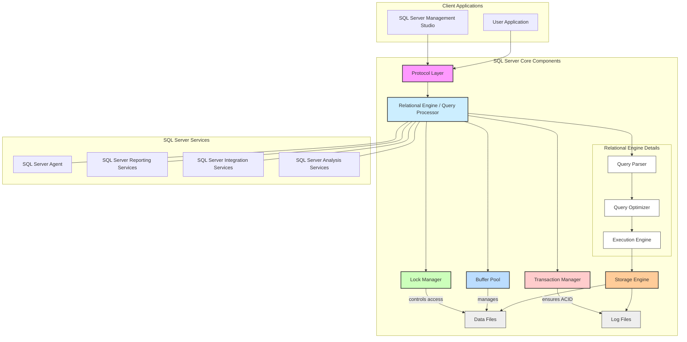
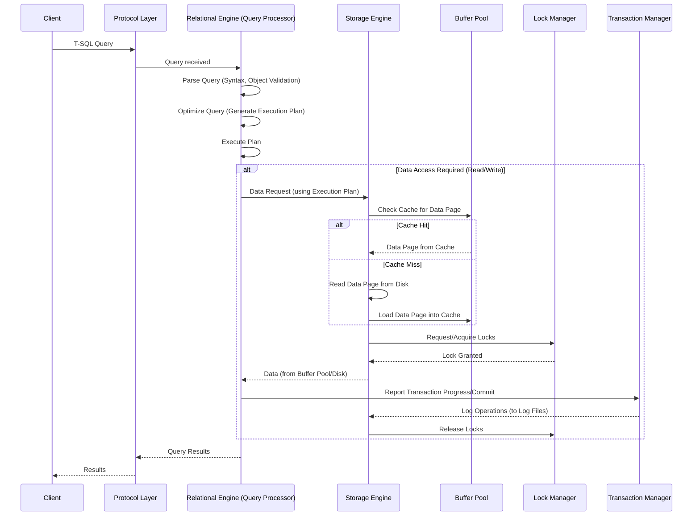

# Module 1: **Introduction to Databases & SQL Server**

> **Module Objective**
> To provide learners with a comprehensive understanding of database fundamentals, SQL Server architecture, modeling techniques (ERD, DFD), and the tools required for database development and management.


## Learning Outcomes

By the end of this module, learners will be able to:

1. Explain the fundamental concepts of relational and non-relational databases.
2. Design and interpret ERDs and DFDs.
3. Describe SQL Server architecture and its key components.
4. Identify various SQL Server editions and related tools.
5. Compare SQL Server with other popular database platforms.
6. Install SQL Server and explore its environment.


## Reference Materials

* **Books:**

  * "Database System Concepts" by Silberschatz, Korth, and Sudarshan
  * "Microsoft SQL Server 2022: A Beginner’s Guide" by Dusan Petkovic
* **Online Resources:**

  * Microsoft Learn: SQL Server Introduction
  * ERDPlus ([https://erdplus.com](https://erdplus.com))
  * Lucidchart ([https://www.lucidchart.com](https://www.lucidchart.com))
  * draw\.io ([https://app.diagrams.net](https://app.diagrams.net))
  * Azure SQL Documentation ([https://learn.microsoft.com/en-us/azure/azure-sql/](https://learn.microsoft.com/en-us/azure/azure-sql/))


## Key Concepts & Detailed Content


### 1. **Introduction to Databases**

* **Definition**: A database is a collection of interrelated data and programs designed to access and modify that data.
* **Types**:
  * **Relational (SQL Server, MySQL, PostgreSQL)**: These are the most common type, organizing data into one or more tables (or "relations") of rows and columns. Each row is a record, and each column represents an attribute. Relationships between tables are established using common fields. They use SQL (Structured Query Language) for defining and manipulating data.
  * **NoSQL (MongoDB, Cassandra)**: These databases provide a mechanism for storage and retrieval of data that is modeled in means other than the tabular relations used in relational databases. They are often used for handling large sets of distributed data and are popular in big data and real-time web applications.
  * **Hierarchical (IBM Information Management System (IMS). While less common in new development, they are still used in legacy systems.)**: An older type of database where data is organized in a tree-like structure. Data is stored as "records" that are connected to one another through "links," resembling a one-to-many relationship (parent-child).
  
* **Core Elements**:

  * **Entities**: An entity is a "thing" or "object" in the real world that is distinct from all other objects. Entities can be concrete, such as a person or a book, or abstract, like a course offering or a flight reservation. An entity set is a collection of entities of the same type that share similar properties or attributes. For example, "instructor" could be an entity set representing all instructors at a university.
  * **Attributes**: Attributes are descriptive properties that each member of an entity set possesses. They define the characteristics of an entity. For instance, an instructor entity set might have attributes like ID, name, dept_name, and salary. Each entity will have its own specific value for each attribute.
  * **Relationships**: Relationships describe how entities are connected or associated with each other. For example, in a university database, a student entity might "take" a course offering entity, and an instructor entity "teaches" a course offering. These "takes" and "teaches" are examples of relationships between entities. The Entity-Relationship (E-R) model helps in mapping these real-world meanings and interactions into a conceptual schema for the database.
 
* **ACID Properties**: ACID is an acronym for a set of properties that guarantee valid and reliable database transactions. These properties are crucial for ensuring data integrity, especially in concurrent environments.
    * **Atomicity**: Ensures that a transaction is treated as a single, indivisible unit of work. Either all of the operations within the transaction are completed successfully, or none of them are. If any part of the transaction fails, the entire transaction is rolled back, leaving the database in its state before the transaction began. (e.g., in a money transfer, either both deduction from one account and addition to another happen, or neither does).
    * **Consistency**: Ensures that a transaction brings the database from one valid state to another valid state. All data must follow predefined rules, constraints, and cascades. If a transaction violates any rules, it's rolled back. (e.g., if a database rule says account balances must be positive, a transaction that would make it negative will be rejected).
    * **Isolation**: Guarantees that concurrent transactions execute in isolation from each other. The intermediate state of a transaction is not visible to other transactions until the transaction is committed. This prevents anomalies that can occur when multiple transactions try to access and modify the same data simultaneously. (e.g., two users trying to book the last available seat on a flight will not interfere with each other, and only one will succeed).
    * **Durability**: Ensures that once a transaction has been committed, it will remain permanent, even in the event of system failures (like power outages or crashes). Committed data is written to non-volatile storage and will survive any subsequent system restart. (e.g., once a payment is confirmed, it will not disappear from the records even if the server crashes right after).

### 2. **Database Design Using ER Diagrams**

Database design using Entity-Relationship (ER) Diagrams is a crucial step in creating efficient and well-structured databases. It involves identifying and modeling the key components of the system.

* **Entity Types**:
    * **Strong (Independent) Entity**: An entity that can exist on its own and has a unique primary key. It does not depend on another entity for its existence. For example, a "Customer" or a "Product" in a shopping cart system.
    * **Weak (Dependent) Entity**: An entity whose existence depends on another (strong) entity. It does not have a primary key of its own; its primary key is derived in part from the strong entity it depends on. For example, "Payment Details" for a specific order, where the payment details wouldn't exist without the order.

* **Attributes**:
    * **Simple**: An attribute that cannot be broken down into smaller, meaningful parts. For example, "Name" or "Price".
    * **Composite**: An attribute that can be divided into several simpler attributes. For example, "Address" could be composed of "Street", "City", and "Zip Code".
    * **Derived**: An attribute whose value can be calculated from other attributes and is not stored directly in the database. For example, "Total Order Amount" can be derived from the sum of prices of all items in an order.

* **Relationships**:
    * **One-to-One (1:1)**: Each entity in one set is related to at most one entity in another set. For example, a "Customer" might have one "Shopping Cart" at a time.
    * **One-to-Many (1:N)**: One entity in the first set can be related to multiple entities in the second set, but each entity in the second set is related to at most one entity in the first set. For example, one "Order" can have many "Order Items".
    * **Many-to-Many (M:N)**: Entities in both sets can be related to multiple entities in the other set. For example, many "Customers" can "buy" many "Products", and many "Products" can be "bought" by many "Customers".

* **Notation and Symbols**:
    Various graphical notations are used to draw ER Diagrams, helping to visually represent the entities, attributes, and relationships. Common ones include:
    * **Crow’s Foot Notation**: Popular for its clear representation of cardinality (the "one" or "many" side of a relationship) using symbols that resemble a crow's foot.
 
        ```mermaid
         erDiagram
            A ||--o| B : "One or Zero"
            C ||--|| D : "One and only One"
            E ||--o{ F : "Zero or Many"
            G ||--|{ H : "One or Many"
        ```
    
        #### `A ||--o| B : "One or Zero"`
        
        * **Left (A)**: Exactly **one** (`||`)
        * **Right (B)**: **Optional** (zero or one) (`o|`)
        * **Meaning**: One `A` is associated with **zero or one** `B`
        
        #### `C ||--|| D : "One and only One"`
        
        * **Both sides**: Exactly **one** (`||`)
        * **Meaning**: One `C` is associated with exactly **one** `D`, and vice versa — a **1:1 relationship**
        
        #### `E ||--o{ F : "Zero or Many"`
        
        * **Left (E)**: Exactly **one** (`||`)
        * **Right (F)**: **Zero or many** (`o{`)
        * **Meaning**: One `E` can be associated with **zero, one, or many** `F`s — a **1\:N (optional)** relationship
        
        #### `G ||--|{ H : "One or Many"`
        
        * **Left (G)**: Exactly **one** (`||`)
        * **Right (H)**: **One or many** (`|{`)
        * **Meaning**: One `G` must be associated with **at least one** `H` — a **1\:N (mandatory)** relationship
            
    * **UML (Unified Modeling Language)**: While primarily used for object-oriented design, UML class diagrams can be adapted to model ER concepts.
    * **Chen Notation**: An older, more traditional notation that uses rectangles for entities, diamonds for relationships, and ovals for attributes.
 
#### 2.1. This ER Diagram below models a simplified e-commerce or shopping cart system. Let's break down its components:


* **CUSTOMER**: Represents individuals making purchases.
    * `CustomerID` (PK): Unique identifier for each customer.
    * `Name`, `Email`: Simple attributes storing customer information.
    * `Street`, `City`, `ZipCode`: These collectively form a **Composite Attribute** named "CustomerAddress," although individually listed here.
* **PRODUCT**: Represents items available for purchase.
    * `ProductID` (PK): Unique identifier for each product.
    * `Name`, `Price`: Simple attributes describing the product.
* **ORDER**: Represents a customer's purchase.
    * `OrderID` (PK): Unique identifier for each order.
    * `OrderDate`: Simple attribute indicating when the order was placed.
    * `Total_Order_Amount` (Derived): This is a **Derived Attribute**, meaning its value is calculated from the prices and quantities of the products within the order, rather than being stored directly.
* **PAYMENT_DETAILS**: Represents the payment information for an order.
    * `TransactionID` (PK): Unique identifier for a payment transaction.
    * `PaymentMethod`, `Amount`: Simple attributes.
    * **Weak Entity**: This entity is likely a weak entity, as specific payment details usually depend on the existence of an `ORDER`. The relationship `ORDER ||--o{ PAYMENT_DETAILS` suggests this dependency.
* **SHOPPING_CART**: Represents a customer's current shopping cart.
    * `CartID` (PK): Unique identifier for a shopping cart.
    * `CreationDate`: Simple attribute.
* **ORDER_ITEM**: Represents a specific product included in an order. This often acts as a "bridge" or "junction" entity to resolve many-to-many relationships.
    * `ItemID` (PK): Unique identifier for each item within an order.
    * `OrderID` (FK): Foreign key linking to the `ORDER` it belongs to.
    * `ProductID` (FK): Foreign key linking to the `PRODUCT` being ordered.
    * `Quantity`: Simple attribute indicating how many units of the product are in this order item.

#### 2.2 Relationships and Cardinality:

* **CUSTOMER ||--o{ ORDER : places**
    * **One-to-Many (1:N)**: A `CUSTOMER` can `places` many `ORDER`s, but each `ORDER` is placed by only one `CUSTOMER`. The `||--o{` notation means "exactly one" on the left side (customer) and "zero or many" on the right side (order).
* **CUSTOMER ||--|| SHOPPING_CART : has**
    * **One-to-One (1:1)**: A `CUSTOMER` `has` exactly one `SHOPPING_CART`, and a `SHOPPING_CART` belongs to exactly one `CUSTOMER`.
* **CUSTOMER }|--|{ PRODUCT : buys**
    * **Many-to-Many (M:N)**: Many `CUSTOMER`s can `buys` many `PRODUCT`s, and many `PRODUCT`s can be `bought` by many `CUSTOMER`s. The `}|--|{` notation signifies "many" on both sides. In a relational database, this relationship is typically resolved by an intermediary table, which in our diagram is `ORDER_ITEM`.
* **ORDER ||--o{ ORDER_ITEM : consists_of**
    * **One-to-Many (1:N)**: An `ORDER` `consists_of` many `ORDER_ITEM`s, but each `ORDER_ITEM` belongs to only one `ORDER`.
* **ORDER ||--o{ PAYMENT_DETAILS : has**
    * **One-to-Many (1:N)**, specifically representing a **Weak Entity Relationship**: An `ORDER` `has` many `PAYMENT_DETAILS` (though often it's one order to one payment, this notation allows for multiple payments or payment attempts). The `o{` on the `PAYMENT_DETAILS` side also implies it might be a weak entity, relying on `ORDER` for its existence.
* **PRODUCT ||--o{ ORDER_ITEM : contains**
    * **One-to-Many (1:N)**: A `PRODUCT` can be `contains` in many `ORDER_ITEM`s, but each `ORDER_ITEM` `contains` only one `PRODUCT`. This relationship, along with `ORDER ||--o{ ORDER_ITEM`, shows how `ORDER_ITEM` acts as the bridge for the many-to-many relationship between `ORDER` and `PRODUCT`.

### 3. **System Analysis Using Data Flow Diagrams (DFDs)**

Data Flow Diagrams (DFDs) are a fundamental tool in system analysis, used to visually represent how data moves through a system. In the context of a Shopping Cart System, DFDs help us understand the flow of information from customers, through various system processes, and into data storage.

* **DFD Levels**: DFDs are often structured in hierarchical levels to provide increasing detail.
    * **Context Diagram (Level 0)**: This is the highest-level DFD, representing the entire Shopping Cart System as a single process. It shows the system's interaction with external entities (sources and sinks of data). For our Shopping Cart System, the primary external entity would be the `Customer`. Data flows would include `Customer Request`, `Product Information`, `Order Details`, `Payment Confirmation`, etc.
    * **Level-1 (Detailed) DFD**: This level breaks down the single process from the context diagram into its major sub-processes. For a Shopping Cart System, these might include:
        * `Browse Products`
        * `Manage Shopping Cart`
        * `Place Order`
        * `Process Payment`
        * `Manage Customer Accounts`
        It would show how data flows between these sub-processes, data stores (which correspond to the entities in your ERD), and external entities.

* **Elements**: DFDs use a specific set of symbols to represent different components:
    * **Processes (Circles or Rounded Rectangles)**: Transform incoming data flows into outgoing data flows. Examples in a shopping cart system: `Add Item to Cart`, `Calculate Order Total`, `Verify Payment`.
    * **Data Stores (Open Rectangles or Parallel Lines)**: Represent a place where data is held or stored within the system. These directly correspond to the entities from your ERD: `Customer` (Data Store for Customer information), `Product` (Data Store for product catalog), `Order` (Data Store for order history), `Payment_Details` (Data Store for payment records), and `Shopping_Cart` (Data Store for active shopping carts), `Order_Item` (Data Store for individual items within orders).
    * **Data Flows (Arrows)**: Represent the movement of data between processes, data stores, and external entities. Examples: `Product Search Query` (from Customer to Browse Products), `Added Item Details` (from Manage Shopping Cart to Shopping_Cart Data Store), `Order Confirmation` (from Place Order to Customer).
    * **External Entities (Squares)**: Represent sources or destinations of data outside the system's boundaries. For the Shopping Cart System, the primary external entity is the `Customer`. Other potential external entities could be a `Payment Gateway` (for processing payments) or a `Warehouse/Fulfillment System` (for shipping orders).

* **Mapping**: After designing DFDs, the information gathered can be used to inform the database design, particularly for converting DFD elements into relational schema components:
    * **Data Stores** directly map to **tables** in a relational database. For instance, the `Customer` data store would become the `Customer` table, the `Product` data store would become the `Product` table, and so on.
    * **Data Flows** help identify the attributes needed within these tables and the relationships between them. For example, a "Product Details" data flow to a "Display Products" process would suggest that the `Product` table needs attributes like `Name`, `Price`, and `Description`.
    * **Processes** help define the operations (e.g., SQL queries, stored procedures, application logic) that will be performed on the data within the tables to fulfill the system's functions (e.g., adding an item, placing an order, processing a payment).

* **Case Study: Design DFD for Shopping Cart System**:
    * **DFD**:
        * **Context Diagram (Level 0)**:
            * **External Entity**: `Customer`
            * **Process**: `Shopping Cart System`
            * **Data Flows**: `Customer Request`, `Product Catalog`, `Order Information`, `Payment Info`, `Confirmation`
 
        ```mermaid
        graph TD
            A[Customer] -->|Customer Request| B(Shopping Cart System)
            B -->|Product Catalog, Order Info, Payment Conf., Status Messages| A
        ```
        
        * **Explanation of Level 0 DFD:**
        
          * **External Entity**: `Customer` (represented by a square `A`) is the primary external entity interacting with the system.
          * **Process**: `Shopping Cart System` (represented by a rounded rectangle `B`) is the single process representing the entire system.
          * **Data Flows**:
              * The `Customer` sends `Customer Request` to the `Shopping Cart System`.
              * The `Shopping Cart System` sends back `Product Catalog`, `Order Info`, `Payment Conf.`, and `Status Messages` to the `Customer`.
           
        * **Level 1 DFD (Detailed Diagram)**

        ```mermaid
        graph TD
            subgraph Shopping Cart System
                direction LR
                P1(Browse Products)
                P2(Manage Shopping Cart)
                P3(Checkout & Place Order)
                P4(Process Payment)
                P5(Manage Customer Account)
        
                DS1[Customer Data Store]
                DS2[Product Data Store]
                DS3[Shopping Cart Data Store]
                DS4[Order Data Store]
                DS5[Order Item Data Store]
                DS6[Payment Details Data Store]
            end
        
            A[Customer] -->|Product Search Query| P1
            P1 -->|Product Request| DS2
            DS2 -->|Product Details| P1
            P1 -->|Product Catalog Display| A
        
            A -->|Add/Remove Item Request| P2
            A -->|Update Quantity| P2
            P2 -->|Cart Updates| DS3
            DS3 -->|Current Cart Contents| P2
            P2 -->|Cart Confirmation| A
        
            A -->|Checkout Request| P3
            A -->|Shipping Info| P3
            A -->|Initial Payment Info| P3
            P3 -->|Get Final Cart| DS3
            P3 -->|New Order Details| DS4
            P3 -->|Order Item Details| DS5
            P3 -->|Payment Request| P4
            P4 -->|Payment Request| B[Payment Gateway]
            B -->|Payment Response| P4
            P4 -->|Save Payment Record| DS6
            P4 -->|Payment Status| P3
            P3 -->|Order Confirmation| A
            P3 -->|Payment Status to Customer| A
        
            A -->|Account Login| P5
            A -->|Profile Update Request| P5
            P5 -->|Customer Account Updates| DS1
            DS1 -->|Customer Profile| P5
            P5 -->|Profile Update Conf/Error| A
        
            DS1 -- Customer Info --> P3
            DS2 -- Product Price Lookup --> P3
            DS4 -- Order History Request --> P5
            P5 -- Order History Details --> DS4
        ```
        
        * **Explanation of Level 1 DFD:**
        
          * **External Entities**:
              * `Customer` (represented by `A`) remains the primary external entity.
              * `Payment Gateway` (represented by `B`) is introduced as another external entity that interacts specifically with the payment processing.
          * **Processes**: The single "Shopping Cart System" is now broken down into five main sub-processes:
              * `Browse Products` (`P1`): Handles product search and display.
              * `Manage Shopping Cart` (`P2`): Manages adding, removing, and updating items in the cart.
              * `Checkout & Place Order` (`P3`): Orchestrates the finalization of an order, including shipping and initial payment details.
              * `Process Payment` (`P4`): Handles the actual payment transaction.
              * `Manage Customer Account` (`P5`): Deals with customer login and profile management.
          * **Data Stores**: These correspond directly to the entities identified in your ER Diagram:
              * `Customer Data Store` (`DS1`)
              * `Product Data Store` (`DS2`)
              * `Shopping Cart Data Store` (`DS3`)
              * `Order Data Store` (`DS4`)
              * `Order Item Data Store` (`DS5`)
              * `Payment Details Data Store` (`DS6`)
          * **Data Flows**: The arrows show the movement of specific data between these processes, data stores, and external entities. For example:
              * A `Customer` sends a `Product Search Query` to `Browse Products`.
              * `Browse Products` retrieves `Product Details` from the `Product Data Store` and displays the `Product Catalog` to the `Customer`.
              * When an order is placed, `Checkout & Place Order` sends `Payment Request` to `Process Payment`, which then interacts with the `Payment Gateway` to process the transaction and updates the `Payment Details Data Store`.
              * The diagram also shows how customer account information is managed and updated.

### 4. **Data Structures & Normalization**

Understanding how data is structured and organized within a database is crucial for its efficiency, integrity, and maintainability. This section covers the fundamental concepts of table anatomy, constraints, and the various levels of normalization.

* **Table Anatomy**:
    * **Rows (Records/Tuples)**: A single entry in a table, representing a single instance of the entity. For example, in a `CUSTOMER` table, each row would represent a unique customer.
    * **Columns (Fields/Attributes)**: Represent a specific piece of information or property about the entity. Each column has a unique name within the table. For example, in a `CUSTOMER` table, `CustomerID`, `Name`, and `Email` would be columns.
    * **Data Types**: Define the type of data that can be stored in a column (e.g., `INT` for integers, `VARCHAR` for variable-length strings, `DATE` for dates, `DECIMAL` for numbers with decimal places). Choosing appropriate data types ensures data integrity and optimizes storage.

* **Constraints**: Rules enforced on data columns to limit the type of data that can be entered, ensuring data accuracy and reliability.
    * `NOT NULL`: Ensures that a column cannot have a `NULL` (empty) value. For example, a `CustomerID` should always have a value.
    * `UNIQUE`: Ensures that all values in a column (or a group of columns) are distinct. For example, `Email` in a `CUSTOMER` table might be `UNIQUE` to prevent duplicate email registrations.
    * `DEFAULT`: Provides a default value for a column when no value is explicitly specified during data insertion. For example, `OrderDate` could default to the current date.
    * `CHECK`: Enforces a condition that all values in a column must satisfy. For example, a `Price` column might have a `CHECK` constraint to ensure values are always greater than 0.
    * `PRIMARY KEY`: Uniquely identifies each row in a table. It must contain `UNIQUE` values and cannot contain `NULL` values. A table can have only one `PRIMARY KEY`. For example, `CustomerID` in the `CUSTOMER` table.
    * `FOREIGN KEY`: A field (or collection of fields) in one table that refers to the `PRIMARY KEY` in another table. It establishes a link between two tables, enforcing referential integrity. For example, `OrderID` in the `ORDER_ITEM` table would be a `FOREIGN KEY` referencing the `OrderID` in the `ORDER` table.

* **Normalization**: A systematic process of structuring a relational database in order to minimize data redundancy and improve data integrity. It involves breaking down large tables into smaller, less redundant tables and defining relationships between them.

    * **1NF (First Normal Form): Atomicity**:
        * Each column must contain only atomic (indivisible) values. This means no repeating groups or multi-valued attributes within a single cell.
        * Each row must be unique (have a primary key).
    * **2NF (Second Normal Form): Partial Dependency Removal**:
        * Must be in 1NF.
        * All non-key attributes (attributes not part of the primary key) must be fully dependent on the *entire* primary key. If the primary key is composite (made of multiple columns), no non-key attribute should depend on only a part of it.
    * **3NF (Third Normal Form): Transitive Dependency Removal**:
        * Must be in 2NF.
        * No non-key attribute should be transitively dependent on the primary key. This means no non-key attribute should depend on another non-key attribute. For example, if `A` determines `B`, and `B` determines `C`, then `A` transitively determines `C`. In 3NF, `C` should directly depend on `A` or be moved to a separate table.
    * **BCNF (Boyce-Codd Normal Form)**:
        * Must be in 3NF.
        * Every determinant must be a candidate key. A determinant is any attribute or set of attributes on which some other attribute is functionally dependent. BCNF is a stricter form of 3NF, addressing certain anomalies that 3NF might miss, especially with composite keys and overlapping candidate keys.
    * **4NF (Fourth Normal Form)**:
        * Must be in BCNF.
        * No multi-valued dependencies. A multi-valued dependency occurs when there are two or more independent multi-valued attributes in the same table that are dependent on the same determinant.
    * **5NF (Fifth Normal Form / Project-Join Normal Form)**:
        * Must be in 4NF.
        * No join dependency. This means a table cannot be decomposed into smaller tables without losing information, where the original table can be reconstructed by joining the smaller tables. It eliminates redundancy that can arise from having multiple overlapping candidate keys.

* **Denormalization**: A strategy used to intentionally introduce redundancy into a database by combining tables or adding derived data, typically to improve query performance. This is often done after normalization, when specific performance bottlenecks are identified. While it can speed up read operations (queries), it might increase data redundancy and complexity in managing data consistency during write operations.

### 5. **Overview of SQL Server**

* **What is RDBMS?**

  * Relational model by Codd
* **SQL Server Editions**:

  * Enterprise, Standard, Developer, Express
* **Use Cases**:

  * OLTP, Data Warehousing, Business Intelligence
* **Licensing Models**:

  * Core-based, CAL-based


### 6. **SQL Server Architecture**

SQL Server is a robust relational database management system (RDBMS) developed by Microsoft. Its architecture is designed to efficiently store, retrieve, manage, and secure data. Understanding its core components and how a query is processed is fundamental to optimizing its performance and ensuring data integrity.

  * **Components**:

      * **Database Engine**: This is the core service of SQL Server. It's responsible for managing all database operations, including data storage, processing, and security. It contains both the Relational Engine (which processes queries) and the Storage Engine (which manages files, pages, and indexing).
      * **Storage Engine**: This component is responsible for the physical data management. It handles all operations related to input/output (I/O) to the database files (data files and log files). Key functions include:
          * Managing how data is stored on disk (pages, extents).
          * Implementing indexing for faster data retrieval.
          * Ensuring data recovery and consistency through logging.
      * **Query Processor (or Relational Engine)**: This component is the brain behind executing T-SQL (Transact-SQL, Microsoft's proprietary extension to SQL) statements. Its main tasks include:
          * **Parsing**: Checking the syntax of the T-SQL query and translating it into an internal representation.
          * **Optimization**: Generating an efficient execution plan for the query. This is a critical step where the optimizer considers various factors (indexes, statistics, joins) to find the fastest way to retrieve the requested data.
          * **Execution**: Running the chosen execution plan to perform the actual data retrieval or modification.
      * **Buffer Pool**: This is the main memory area within SQL Server that acts as a cache for data pages read from disk. When data is requested, the Storage Engine first checks the Buffer Pool. If the data is present (a "cache hit"), it's retrieved much faster than from disk. If not (a "cache miss"), the data is read from disk into the Buffer Pool for future use. Efficient use of the Buffer Pool is vital for performance.
      * **Lock Manager**: In a multi-user environment, multiple users might try to access or modify the same data simultaneously. The Lock Manager is responsible for concurrency control, ensuring that data integrity is maintained. It acquires and releases various types of locks (e.g., shared locks for reads, exclusive locks for writes) on database resources (rows, pages, tables) to prevent conflicts and maintain the ACID properties (Atomicity, Consistency, Isolation, Durability) of transactions.
      * **SQL Server Agent**: A background service that automates and executes scheduled administrative tasks, such as backups, replication, and job execution.
      * **SQL Server Reporting Services (SSRS)**: A platform used for creating, deploying, and managing various types of reports from different data sources.
      * **SQL Server Integration Services (SSIS)**: A platform for building high-performance data integration and workflow solutions. It's commonly used for Extract, Transform, Load (ETL) operations.
      * **SQL Server Analysis Services (SSAS)**: A tool for Online Analytical Processing (OLAP) and data mining, used to create analytical databases (cubes) for business intelligence.

  * **Query Lifecycle**: When a T-SQL query is submitted to SQL Server, it goes through a well-defined lifecycle:

    1.  **Protocol Layer**: The query first arrives at the Protocol Layer, which manages the communication between the client application and the SQL Server instance.
    2.  **Parsing**: The query text is parsed by the Query Parser (part of the Relational Engine). This step checks for syntax errors, validates object names (tables, columns), and converts the query into a query tree (a logical representation).
    3.  **Optimization**: The Query Optimizer takes the query tree and generates several possible execution plans. It analyzes statistics, indexes, and existing data to estimate the cost (CPU, I/O) of each plan and selects the most efficient one. This chosen plan dictates how the data will be accessed and processed.
    4.  **Execution**: The Execution Engine then takes the optimized execution plan and performs the actual operations. It interacts with the Storage Engine to retrieve or modify data, utilizing the Buffer Pool for caching and the Lock Manager for concurrency control. The results are then returned to the client.

**Block Diagram of SQL Server Architecture:**



**Sequence Diagram of SQL Server Query Lifecycle:**



### 7. **System Databases in SQL Server**

| Database   | Description                |
| ---------- | -------------------------- |
| `master`   | System-wide configurations |
| `model`    | Template for new databases |
| `msdb`     | SQL Agent, scheduling      |
| `tempdb`   | Temporary objects          |
| `resource` | Internal system metadata   |


### 8. **SQL Server Tool Ecosystem**

* **GUI Tools**:

  * SSMS (SQL Server Management Studio)
  * Azure Data Studio
* **CLI Tools**:

  * `sqlcmd`, `bcp`, PowerShell
* **Development Integration**:

  * Visual Studio + SSDT
  * Git integration, CI/CD support


### 9. **SQL Server on Cloud & Linux**

* **Azure SQL Models**:

  * Azure SQL DB (PaaS), Managed Instance (hybrid), SQL VM (IaaS)
* **Linux & Docker**:

  * Cross-platform support via Docker images and Ubuntu installations
* **Cloud Strategy**:

  * Scalability, HA, global replication


### 10. **SQL Server vs Other Platforms**

| Feature       | SQL Server    | Oracle      | MySQL       | PostgreSQL    |
| ------------- | ------------- | ----------- | ----------- | ------------- |
| Platform      | Windows/Linux | Cross       | Cross       | Cross         |
| Licensing     | Proprietary   | Proprietary | Open Source | Open Source   |
| ACID Support  | Full          | Full        | Full        | Full          |
| Cloud Options | Azure         | OCI         | AWS RDS     | AWS/GCP/Azure |
| Extensions    | Limited       | PL/SQL      | Plugins     | Extensions    |

* **NoSQL Brief**:

  * MongoDB: Document-based
  * Cassandra: Wide-column for distributed setups


## Lab Exercises / Hands-On Practice

| # | Task                                             | Tool                | Outcome                |
| - | ------------------------------------------------ | ------------------- | ---------------------- |
| 1 | Install SQL Server (Developer Edition or Docker) | SSMS/Docker         | Local DB setup         |
| 2 | Explore System Databases                         | SSMS                | View internal DB roles |
| 3 | Create ERD for E-Commerce DB                     | draw\.io/Lucidchart | Logical data model     |
| 4 | Draw Level-1 DFD for LMS                         | draw\.io            | Visual data flow model |
| 5 | Compare schema in SQL Server vs PostgreSQL       | SSMS + pgAdmin      | Feature comparison     |


## Assessments

### Knowledge Checks (MCQs)

1. What is the purpose of the `tempdb` system database?
2. Which of the following is NOT a relational database?
3. Define a composite attribute in ER modeling.

### Short Answer Questions

* Explain 2NF with an example.
* Compare SQL Server and MySQL for web applications.

### Practical Task

* Design an ERD and a Level-1 DFD for a hospital management system.
